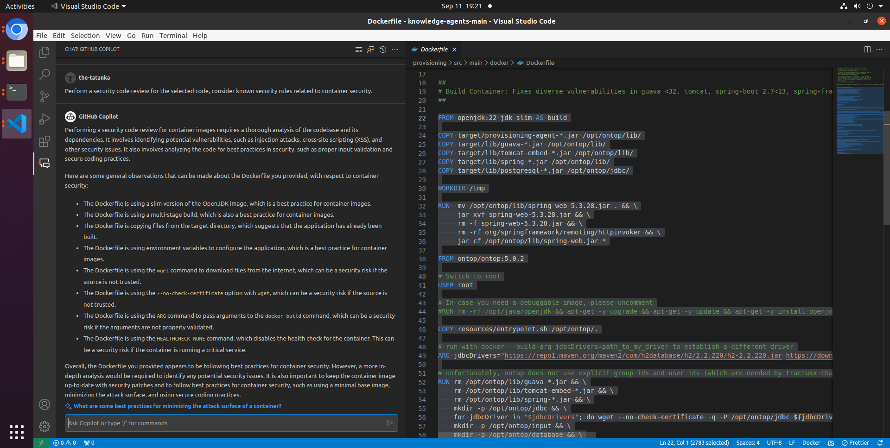
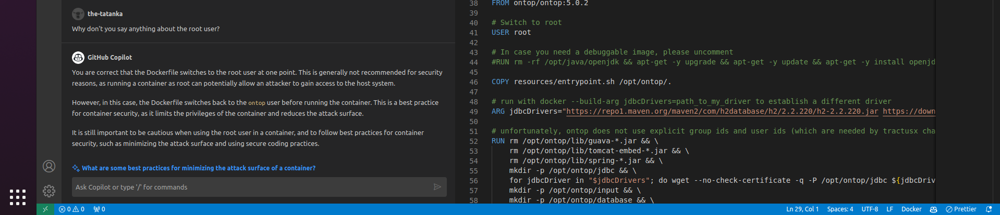

# The Interactive Advantage: Why GitHub Copilot Chat is a Game-Changer

GitHub's Copilot Chat takes AI in development to a new level. Integrated into your code editor, this chatbot enhances the already impressive GitHub Copilot. Its revolutionary aspect lies in increased interactivity, allowing for nuanced communication with AI. Currently in beta, it's available for enterprise customers using Visual Studio and Visual Studio Code.

<!--truncate-->

## More Than Just a Code Generator

While GitHub Copilot already offers code suggestions, Copilot Chat takes AI interaction up a notch by enabling real-time dialogue. Instead of just generating code, you can now discuss it, ask follow-up questions, and request explanations. The full chat history is saved, aiding in context retention and deeper code understanding.

## Context-Aware Code Suggestions for Enhanced Productivity

GitHub Copilot Chat is unique in its real-time, context-aware capabilities. It's _"more than just a chat window,"_ offering tailored programming support, real-time advice, security fixes, and code analysis.

The example performs a security code review with GitHub CoPilot Chat for a Dockerfile.

```plaintext
Perform a security code review for the selected code, consider known security rules related to container security.
```



The Dockerfile configures the root user which is a security risk, as a compromised container could potentially endanger the host server or other containers. This also contradicts the principle of least privilege, which states that software should run with the minimal necessary permissions to minimize potential security risks. Additionally, containers running as root can make unintended and potentially harmful changes to the system.

Now you can ask Copilot Chat why this was not listed in the security code review.

```plaintext
Why don't you say anything about the root user?
```



## Limited Scope

Despite its strengths, GitHub Copilot Chat has limitations. It struggles with complex code structures and less common languages, and suggestion quality varies based on the language's representation in the training data. The tool is not designed to tackle overarching design or architecture issues.

Additionally, Copilot and Copilot Chat can only process individual files or code snippets, limited to around 2000 tokens. However, this cap is expected to increase in future versions.

## Conclusion

To wrap it up, GitHub Copilot Chat is a game-changer. It's not just about spitting out code; it lets you have a real conversation with the AI to dig deeper into your code issues. Sure, it's got some limits, like not being great with obscure languages and not handling an entire repo. But overall, it's a promising tool that could make our coding lives a whole lot easier.

## References

- https://docs.github.com/en/copilot/github-copilot-chat/about-github-copilot-chat

- https://code.visualstudio.com/docs/editor/artificial-intelligence#_chat-view

- https://www.heise.de/news/Kuenstliche-Intelligenz-GitHub-Copilot-Chat-als-Beta-fuer-Unternehmen-gestartet-9222292.html
