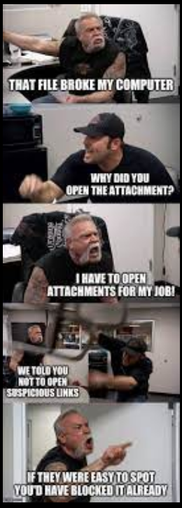

# How to Suck at Information Security

This [cheat sheet](https://zeltser.com/suck-at-security-cheat-sheet/) presents common information security mistakes, so you can avoid making them.

Yeah, the idea is that you should do the opposite of what it says.

<!--truncate-->
