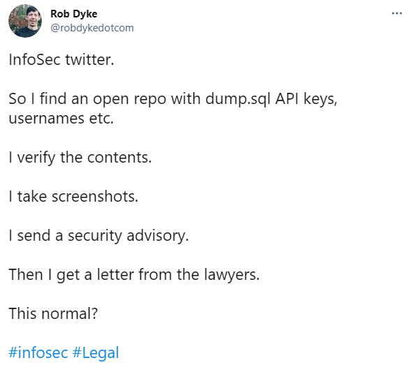

# Full Disclosure: Ensuring Everyone Has the Information They Need

:::info

While I personally lean towards the Coordinated Disclosure approach, in this article I delve deep into the perspective of my more _free-thinking_ security colleagues to better understand their viewpoint.

:::

Ensuring that software or hardware vendors can address vulnerabilities before bad actors can find and exploit them is crucial.

Vulnerability disclosures can be controversial because vendors often prefer to wait until a patch or other form of mitigation is available before making the vulnerability public. However, security professionals and enterprises whose sensitive data or systems may be at risk prefer that disclosures be made public as soon as possible.

All software has security vulnerabilities, and demonstrating a clear and established process for handling and disclosing them gives far more confidence in the security of the software than trying to hide the issues.

<!--truncate-->

_As a side note, [this happened](https://portswigger.net/daily-swig/security-researcher-launches-gofundme-campaign-to-fight-legal-threat-over-vulnerability-disclosure) before Elon Musk acquired Twitter._

**Full disclosure** is the practice of publishing analysis of software vulnerabilities as early as possible, making the data accessible to everyone without restriction. The primary purpose of widely disseminating information about vulnerabilities is so that potential victims are as knowledgeable as those who attack them.

> _"Full disclosure, - the practice of making the details of security vulnerabilities public - is a damned good idea. Public scrutiny is the only reliable way to improve security, while secrecy only makes us less secure"._
>
> ~ Bruce Schneier

> _"We don't believe in security by obscurity, and as far as we know, full disclosure is the only way to ensure that everyone, not just the insiders, has access to the information we need"._
>
> ~ Leonard Rose

**Arguments for full disclosure:**

There are some fundamental problems with coordinated disclosure that full disclosure can resolve:

- If customers do not know about vulnerabilities, they cannot request patches, and vendors experience no economic incentive to correct vulnerabilities.

- Administrators cannot make informed decisions about the risks to their systems, as information on vulnerabilities is restricted.

- Malicious researchers who also know about the flaw have a long period of time to continue exploiting the flaw.

**Arguments against full disclosure:**

- Many end-users cannot benefit from access to vulnerability information without guidance or patches from the vendor

- Sharing research with malicious actors, low-skilled attackers can use this information to perform sophisticated attacks that would otherwise be beyond their ability

- _Less_ exposure to malicious attacks while the update is being developed

## Conclusion

The full disclosure approach is primarily used in response to organisations ignoring reported vulnerabilities, in order to put pressure on them to develop and publish a fix.

It is seen as irresponsible by many people. Generally it should only be considered as a last resort, when all other methods have failed, or when exploit code is already publicly available.

Disclosures help to ensure transparency. When you don't operate transparently, your reputation is likely to take a much bigger hit in the event that a major vulnerability emerges and it comes to light that you failed to disclose it.
