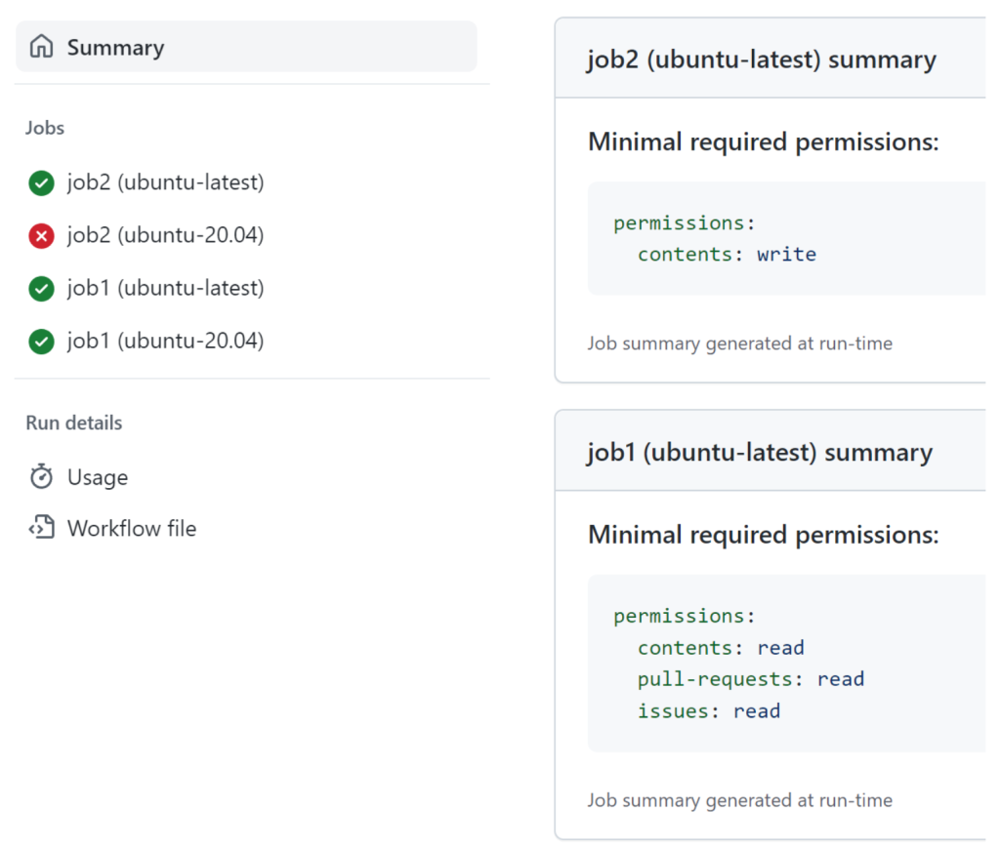

# Secure Your GitHub Actions Workflows with These Tips

_**Disclaimer** - This article is compiled from GitHub articles, linked below in the references. The purpose of this article is to serve as a summary since I found the content of the GitHub articles to be well-structured. My personal thoughts are integrated at relevant points._

Continuous Integration and Continuous Deployment (CI/CD) software supply chains are a lucrative target for threat actors. GitHub Actions is one of the most widely used platforms for automation, making it an important target. It's my personal favourite compared to GitLab CI/CD and Jenkins.

In the context of workflows, the _primary_ threats include: Command Injections, Pwn Requests, Secret Leaks, and Third-Party Actions.

<!--truncate-->

Due to the dangers inherent to _automatic processing of PRs_, an important security guarantee that GitHub makes is that workflows triggered on `pull_request` from forks (untrusted sources) are run with minimal privileges: no access to secrets and the repository token is read-only. Thus, if a workflow contains potential injection vulnerabilities, but is triggered only on `pull_request`, then the impact is minimal, because only pull requests from users able to create branches in the same repository are able to trigger the workflow with higher privileges.

_Nevertheless, it is better to keep workflows injection free, even if they run with minimal privileges._

In the following sections, the primary threats will be listed along with corresponding tips for mitigation.

## Command Injections

A workflow is a program that starts automatically when a specific repository event occurs. As with any program potentially started by an external user, user-controlled inputs should be treated as untrusted. In the context of workflows, this means values such as `github.event.issue.title` or `github.event.issue.body`. In particular, GitHub Actions expression evaluation is a powerful language-independent feature which may lead to script injections when used in such blocks as `run`.

This is a simple example of a workflow that is vulnerable to command injection:

```yaml
- run: echo "${{ github.event.issue.title }}"
```

To exploit this, an attacker would create an issue with a title like `$(touch pwned.txt)`.

Due to the way that the `${{}}` syntax gets expanded, this causes the workflow to execute the following command `echo "$(touch pwned.txt)"`.

Since expression evaluation is language independent, the injection type is not Bash shell-specific. For example, when `${{}}` is used in a JS script, a syntactically valid construct can be used for injection there, too.

An attacker could use an injection vulnerability like this to achieve something far more malicious than just modifying a local file. For example, they could upload secrets to a website that they control, or commit new code to your repository to add a backdoor vulnerability or supply chain attack.

_When used in the `run` or `script` section, the `${{ }}` syntax is almost always very dangerous._

### Tip 1: Don’t Use ${{ }} Syntax in the Run Section to Prevent Unexpected Substitution Issues

The recommendation is to use _intermediate environment variables_ for the potentially untrusted input and then use language-specific capabilities to retrieve the value of the variable:

```yaml
- name: print title
  env:
    TITLE: ${{ github.event.issue.title }}
  run: echo "$TITLE"
```

or

```yaml
- name: print title
  env:
    TITLE: ${{ github.event.issue.title }}
  uses: actions/github-script@v6
  with:
    script: console.log(process.env.TITLE)
```

Using the `${{ }}` syntax in the `env` section is safer because the user-controlled string is stored in a variable instead. The syntax `"$TITLE"` in the updated `run` section is standard Bash syntax, which is widely known and therefore less likely to behave in a way that the author of the workflow didn’t expect. Similarly, the syntax `process.env.TITLE` is standard JavaScript syntax, so the code will behave as expected for a JavaScript program.

_Please note that this solution doesn’t prevent other types of vulnerabilities: the `TITLE` environment still contains untrusted input and still needs to be handled with care._

We should carefully handle potentially untrusted input and make sure it doesn’t flow into API calls where the data could be interpreted as code.

### Tip 2: Enable Code Scanning for Workflows

**I recommend carefully reviewing your workflows, focusing on the usage of untrusted input.**

Additionally, to prevent accidentally introducing similar vulnerabilities in new code, I recommend to utilize code scanning for the repository.

This allows for the automation of workflow reviews. Custom queries can be written to make the scans more precise.

When using CodeQL for scanning, the following considerations must be kept in mind. _The CodeQL workflow scanning queries are (currently) only included in the query suite for JavaScript, so they’re only enabled by default if your project is written in JavaScript._ If the main programming language of your project is something else, such as Python or Java, then you need to manually modify the CodeQL workflow to add JavaScript as an additional language. The scanning will work even if your repository doesn’t contain any JavaScript; and if you are interested only in workflows, but not other JavaScript files, you can exclude some paths in the CodeQL configuration:

```yaml
paths:
  - .github
paths-ignore:
  - .github/workflows/test.yaml
```

Other scanning tools can also be used. For example, KICS provides pre-configured queries that can be extended. A simple script that, for instance, looks for `${{}}`, `pull_request_target`, and `workflow_run` can be quite effective. This way, a dedicated security team can review many repositories, and development teams don't need to delve into the details, allowing them to focus on their development work.

## Pwn Requests

Any automated processing of PRs from an external fork is potentially dangerous and such PRs should be treated like untrusted input. It is common CI/CD practice to ensure that when a new PR is submitted that it does not break the build for your project, that no functionality regressions are introduced, and that tests are passing. But when operating on untrusted PRs, such automated behavior can leave your repository exposed to abuse if you’re not careful.

Since, by definition, a PR supplies code to any build or test logic in place for your project, attackers can achieve arbitrary code execution in a workflow runner operating on a malicious PR in a variety of ways.

They may submit malicious changes to the existing build scripts like `make` or `powershell` files or redefine the build script in the `package.json` file. They can simply write their payload as a new test that will be run with others. Any modern build orchestration is complex enough to have multiple code injection points.

Due to the dangers inherent to automatic processing of PRs, GitHub’s standard pull_request workflow trigger by default prevents write permissions and secrets access to the target repository.

However, in some scenarios such access is needed to properly process the PR. To this end the `pull_request_target` and `workflow_run` workflow triggers were introduced. They enable scenarios that require building the untrusted code, access to repository secrets and also need write permissions to update the PR with e.g. code coverage results or other test results.

### Tip 3: Do Not Use `pull_request_target`

My personal advice is to never use these workflow triggers because they unnecessarily increase the attack surface. They automatically commit you to closely monitoring every PR.

Statement from [GitHub Security Lab](https://securitylab.github.com/research/github-actions-preventing-pwn-requests/):

_"Generally speaking, when the PR contents are treated as passive data, i.e. not in a position of influence over the build/testing process, it is safe. But the repository owners must be extra careful not to trigger any script that may operate on PR controlled contents like in the case of `npm install`."_

Avoid using `pull_request_target` if the workflow doesn’t need write repository permissions and doesn’t use any repository secrets. They can simply use the `pull_request` trigger instead.

You may ask yourself: if the `pull_request_target` workflow only checks out and builds the PR, i.e. runs untrusted code but doesn’t reference any secrets, is it still vulnerable?

Yes it is, because a workflow triggered on `pull_request_target` still has the read/write repository token in memory that is potentially available to any running program. If the workflow uses `actions/checkout` and does not pass the optional parameter `persist-credentials` as `false`, it makes it even worse. The default for the parameter is `true`. It means that in any subsequent steps any running code can simply read the stored repository token from the disk.

Just stick to the `pull_request` trigger.

### Tip 4: Add a Condition to the `pull_request_target`

Add a condition to the `pull_request_target` to run only if a certain label is assigned the PR, like `safe to test` that indicates the PR has been vetted by someone with write privileges to the target repository. Note that this kind of label based verification is still prone to a race condition in which the attacker may push new changes after the workflow was approved (labeled), but has not started yet. As such this approach should only be used as a temporary solution, until a proper fix from the options above is applied. Since external users do not have the permission to assign labels, this effectively requires repository owners to manually review changes first and is also prone to human error.

### Tip 5: Rebase PRs After Fixing a Vulnerable Workflow

All PRs that were opened before a fix was made to the vulnerable workflow will use the version of the workflow as it existed at the time the PR was opened. That means that if there is a pending PR, any updates to the PR may still abuse the vulnerable workflow. It is advisable to either close or rebase such PRs if untrusted commits may be added to them after a vulnerable workflow is fixed.

## Secret Leaks

Workflows triggered via the `pull_request` event from forks have read-only permissions and no access to secrets. With it, the triggered workflow runs in the context of the (submitter's) fork repo. Therefore the provided `GITHUB_TOKEN` will not have write access and the secrets are not accessible either.
However, these permissions differ between the various event triggers such as `issue_comment`, `issues` and `push`. An attacker could try to steal the repository secrets or even the repository write access token. If a secret or token is set to an environment variable like:

```yaml
env:
  GITHUB_TOKEN: ${{ github.token }}
  PUBLISH_KEY: ${{ secrets.PUBLISH_KEY }}
```

It can be directly accessed through the environment as demonstrated with e.g.: `printenv`.

If the secret is used directly in a expression like:

```yaml
- run: publisher ${{ secrets.PUBLISH_KEY }}
```

or

```yaml
uses: fakeaction/publish@v3
with:
  key: ${{ secrets.PUBLISH_KEY }}
```

Then, in the first case, the generated shell script is stored on disk and can be accessed there. In the second case it depends on the way the program is using the argument.

`Actions/checkout` action by default stores the repository token in a `.git/config` file unless the `persist-credentials: false` argument is set. Even if this is not the case the repository token and secrets are still in memory. Although GitHub Actions scrub secrets from memory that are not referenced in the workflow or in an included Action, the repository token, whether it is referenced or not, and any referenced secrets can be harvested by a determined attacker.

The next question for the attacker is how to exfiltrate such secrets from the runner. GitHub Actions automatically redact secrets printed to the log in order to prevent accidental secret disclosure, but it is not a true security boundary since it is impossible to protect from intentional logging, so exfiltration of obfuscated secrets is still possible. For example: `echo ${SOME_SECRET:0:4}; echo ${SOME_SECRET:4:200};`. Also, since the attacker may run arbitrary commands it is possible to simply make a HTTP request to an external attacker-controlled server with the secret.

Getting a repository access token is a bit harder. An Action runner gets a generated token with permissions that are limited to the repository that contains the workflow and which expires after the workflow completes. Once expired, the token is no longer useful to an attacker. One way to work around this limitation, is to automate the attack and perform it in fractions of a second by calling an attacker-controlled server with the token. The attacker server can use the GitHub API to modify repository content, including releases.

### Tip 6: Keep Workflows Injection free

Keep workflows injection free, even if they run with minimal privileges.

The best practice to avoid code and command injection vulnerabilities in GitHub workflows is to set the untrusted input value of the expression to an intermediate environment variable, as previously described.

Refer to the section above on Command Injections for more information.

### Tip 7: Use the Principle of Least Privilege

GitHub introduced a more fine grained permission model for workflow tokens (`GITHUB_TOKEN`) and, today, the default permissions for new repositories and organizations are set to read-only.

If you want to check if you are using a broad default permission for your workflow tokens, you can go to the _repository (or organization) settings->actions and check the “Workflow permissions” section_.

Every GitHub workflow receives a temporary repository access token (`GITHUB_TOKEN`).

To help you more smoothly navigate the transition to a least-privilege workflow token model, we have published a set of GitHub Actions that allow you to monitor and enumerate the set of privileges that are required by a given GitHub workflow.

The [Monitor action](https://github.com/GitHubSecurityLab/actions-permissions/tree/main/monitor) installs a local proxy (no information is sent to any third parties) into your workflow runner, collects information about any GitHub API interactions initiated by the workflow, and then displays the recommended minimal permissions as part of a workflow run summary:



You can grant additional permissions to specific workflows on a case-by-case basis if needed:

```yaml
jobs:
  job_name:
  ...
    permissions:
      issues: write
```

If access to any scope is specified, all unspecified scopes like `contents`, `pull-requests` or `actions` are set to `none`.

## Third-Party Actions

Actions allow you to quickly create automatic workflows from convenient building blocks: actions published by other developers. _GitHub Marketplace_ has thousands of free actions available for consumption.

By referencing an action with the uses: directive, you’re running third-party code and giving it access to:

- Computing time

- Secrets used in the same workflow job

- Your repository token

Read access to secrets, such as deployment keys, could also be used by malicious actors for lateral movement (in other words, for compromising other resources). Although only the secrets referenced or used in the workflow job are potentially accessible to the action, the repository token is different. Even if the GITHUB_TOKEN is not explicitly used in a workflow, it’s still available for all referenced actions. Attackers that control the YAML definition of the action may add, for example, a new input field and set the default value to the repository token:

```yaml
inputs:
  random_name:
    default: ${{ github.token }}
```

It’s fair to assume that anyone who controls the YAML action definition has access to the temporary repository token in a context of the running workflow that consumes the action. This means you should carefully review the permissions you supply to the workflows you’re running.

### Tip 8: Following the Principle of Least Privilege

The principle of least privilege states that software should run with the minimal set of permissions needed to accomplish the task. This applies both to the privileges of secrets available for your workflows and the automatically supplied temporary repository token (`GITHUB_TOKEN`), which is based on the workflow trigger type.

Refer to the previous subsection above on least privilege for more information.

### Tip 9: Properly Referencing Actions

Adding a new action to a workflow requires careful consideration of security impact.

Some actions have a _“Verified creator”_ badge that can help you decide the level of trust you place in the action creator. It is not yet common and therefore unfortunately not very helpful.

The best approach is to audit the code behind the action, just like you would for open source libraries, to assess whether it’s reasonably secure and doesn’t do anything suspicious like sending secrets to third-party hosts. Thankfully, many actions are designed for a single purpose and are relatively easy to read.

Once you’ve verified the action’s code, there are multiple ways of referencing it in your workflow:

- **By full hash changeset reference**: `uses: owner/action-name@26968a09c0ea4f3e233fdddbafd1166051a095f6`. Currently, this is the safest way to reference a specific snapshot of an action.

- **Fork the action**: Depending on your needs, you could fork the action and reference the fork in your workflows. You may need to set up vetted updates from the original repository in order to get potential security fixes, though. _Makes particular sense for actions that are commonly used across the enterprise._

As you can see, all options are a tradeoff between guaranteed supply chain integrity and auto-patching of vulnerabilities in dependencies / actions. In all cases except the last, it’s possible to configure Dependabot to create a pull request when the action is updated. In order to protect repository secrets, such pull requests are treated as if they come from external forks. You can set up actions to automatically accept and merge these pull requests from Dependabot. However, accepting changes without reviewing them isn’t the most secure approach. Every time the referenced action is updated, I recommend that you verify what has changed in the action source code - _that's a real challenge to keep up with_.

## Conclusion

GitHub Actions are a great way to rapidly build a functional CI/CD pipeline for your GitHub projects. From an attacker’s perspective, they are part of a much broader CI/CD attack surface that also includes any third-party artifact integrations and API interactions. Beyond the usual code review for untrusted input handling, CI/CD supply chain integrity requires careful vetting of your dependencies and any changes that occur in those dependencies. By applying the concepts of least privilege, change attestation, and tracking as well as ensuring that third parties don’t have mutable control over your CI/CD supply chain, you can actively start to take charge of your CI/CD supply chain security.

## Resources

- [Four tips to keep your GitHub Actions workflows secure](https://github.blog/2023-08-09-four-tips-to-keep-your-github-actions-workflows-secure/)

- [Keeping your GitHub Actions and workflows secure Part 1: Preventing pwn requests](https://securitylab.github.com/research/github-actions-preventing-pwn-requests/)

- [Keeping your GitHub Actions and workflows secure Part 2: Untrusted input](https://securitylab.github.com/research/github-actions-untrusted-input/)

- [Keeping your GitHub Actions and workflows secure Part 3: How to trust your building blocks](https://securitylab.github.com/research/github-actions-building-blocks/)

- [GitHub Actions Security Best Practices - cheat sheet included](https://blog.gitguardian.com/github-actions-security-cheat-sheet/)
