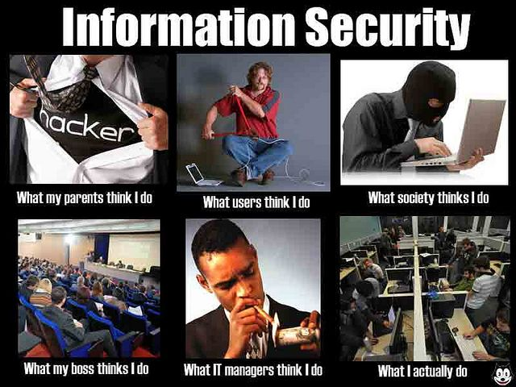

# Security Engineering

Security engineering is a specialized field of engineering that focuses on the design and implementation of systems that are secure from various threats and attacks.

Security engineering ensures the confidentiality, integrity, and availability of systems and data, safeguarding them against threats and unauthorized access.

Enforcing security through extensive, dry policies and long requirements lists can overwhelm developers, stifle innovation, and lead to inconsistent implementation due to ambiguity, lack of context, and decreased motivation; therefore, **security must be developer-friendly to be truly effective**.

When security engineers align with the developer workflow and prioritize automation, it streamlines the integration of security practices, making them more efficient and less intrusive, which in turn facilitates consistent and robust security implementations.

For effective collaboration and implementation of security practices, security engineers need to have a level of proficiency that allows them to understand the intricacies of development processes and the technologies involved. By being as skilled as developers, security engineers can communicate more efficiently, ensuring that security recommendations align with development practices.

This mutual understanding and respect between security engineers and developers foster a more integrated, proactive, and holistic approach to building secure systems (_- sounds so very compliance friendly_).
Security engineers should try not to talk to developers this way, even if it's funny: _"Hey I broke the crap out of your thing, isn't that awesome?"_ [2].

Integrating security early in the development process, or _shifting left,_ leads to early vulnerability detection, cost reductions, improved product quality, enhanced collaboration between teams, **continuous security** feedback in CI/CD processes, a competitive market advantage, smoother regulatory compliance, and a more security-aware developer skillset.

## What a developer-friendly security enginner does

There are many different roles in the field of information security. _I see myself as a security engineer_ and agree with the following definition from Google. The role of a security architect closely aligns with that of a security engineer. However, the fundamental difference is that security engineers are much closer to the technology and the actual code. This proximity allows them to better understand developers, as they can communicate with them on an equal footing. Additionally, compared to security architects, security engineers also have the capability to implement and execute solutions.

That's how Google defines what a developer-friendly security enginner does [1]:

- A security engineer manually analyzes each project to understand its context and specific security needs.

- Following the project's contribution guidelines, suggestions are made for the most impactful improvement, tailored specifically for the project's situation.

- Issues are filed before proposing any PRs to initiate a discussion and address any concerns the maintainer might have.

- Focus is placed on enhancements that can be addressed via pull requests, understanding that maintainers are often stretched thin and aiming to alleviate as much of their workload as possible.

- Contributions are treated as dialogues, valuing the expertise of maintainers who undoubtedly know their project best; their insights help ensure the security measures meet the project's unique requirements.

- Feedback on the work and related technologies is always welcomed, and when necessary, collaboration with the relevant teams is initiated to refine approaches.

- Depending on the project's needs, revisits are made to provide additional improvements and address any ongoing maintenance requirements for the changes that have been introduced.

This approach ensures that suggestions and support for improvements are offered while valuing and respecting the maintainer's time and effort.

## Following Sections

Practical security engineering is presented in the following sections.

The workflows are particularly suitable for open source projects, but can also be transferred to closed source projects in most cases.

Just for my German countrymen the following note - no guarantee for completeness (_don't bring me on the palm_).

## Reference

- [1] - [Google’s Open Source Security Upstream Team: One Year Later](https://opensource.googleblog.com/2023/04/googles-open-source-security-upstream-team-one-year-later.html)

- [2] - [The Disconnect Between Developers and Application Security](https://thenewstack.io/the-disconnect-between-developers-and-application-security/#:~:text=In%20a%20modern%20development%20shop,tools%20to%20produce%20secure%20code.)
