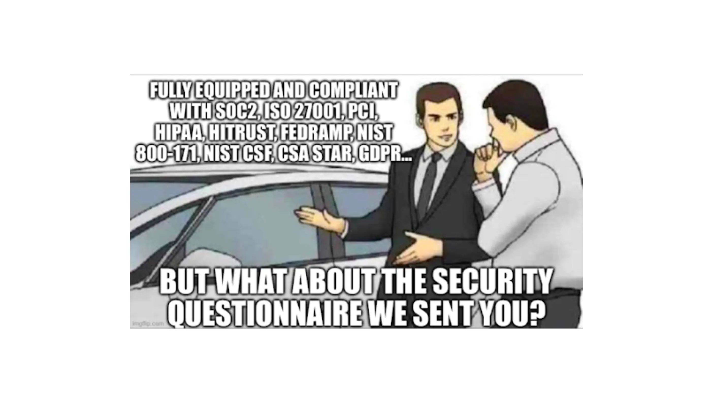

# Checklists, Requirements Catalogs, and Maturity Models

Security isn't about ticking boxes or leveling up like you're in some retro video game. But hey, structured approaches like checklists, requirements catalogs, and maturity models sure do come in handy to give us some direction.

**Checklists** — these are your quick reference guides. They're there to ensure consistency among both internal testing teams and external vendors. Just remember, while they offer tips for planning, reviewing, and even for issuing Request for Information (RFI) documents for security assessments, they're not your endgame.

For example, there's the web application [checklist by Lenny Zeltser](https://zeltser.com/security-architecture-cheat-sheet/). Great place to start, but every application is its own beast.

**Requirements Catalogs** — Alright, moving on to the heavy-duty stuff. The Application Security Verification Standard (ASVS) requirements catalog from OWASP is a favorite. It's widely recognized and could be labeled the quasi-standard for web app requirements. 

While these catalogs can be an excellent reference, expecting teams to meticulously fill them out for every project is like asking someone to read the entire `Terms and Conditions` before clicking `I Agree`. 
Great in theory, but in the real world? Not happening. But they sure are handy as a reference. Got a tricky security question? Dive into one of these catalogs. More often than not, you'll find your answer.

**Maturity Models** — And now for the pièce de résistance. Maturity models like the Cybersecurity Maturity Model Certification (CMMC) or the OWASP Software Component Verification Standard (SCVS) give you a way to measure your security sophistication. Think of them as the health check-ups of the security world. They'll point out what's working, what's not, and where you should be heading.

But (and this is a big _but_), while these models can show you the path, they can't walk it for you. Aim to progress, sure, but don't get so focused on the destination that you forget about the journey. Remember, a model, no matter how comprehensive, won't patch a vulnerability for you.

## Streamlining Security Checks for Developers

Adding _another dashboard tool_ to a developer's toolbelt can be met with justifiable skepticism. Yet, there are tools that stand out in their efforts to bridge the traditional and the modern.

Take _OSSF Scorecard_, for instance. While not flawless, it serves as a beacon for where we should be heading. This tool transcends the checkbox mentality, offering a comprehensive assessment of your code against pivotal security heuristics. Presented as scores ranging from 0 to 10, Scorecard provides developers with an immediate sense of potential security hotspots.

But here's the real game-changer (_~overused word_): tools like Scorecard are designed for the modern development ecosystem. They can operate as GitHub Actions, seamlessly integrating into our workflow. This means that with a mere push of a button, Scorecard can be scaled across every developer project, ensuring consistent and automated security checks.

In a nutshell, while the journey towards a fully integrated and developer-friendly security landscape is ongoing, tools like OSSF Scorecard mark a promising step forward. They represent the evolving synergy of automation and human expertise, pointing the way to a more streamlined and efficient future in security assessment.
